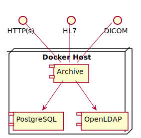
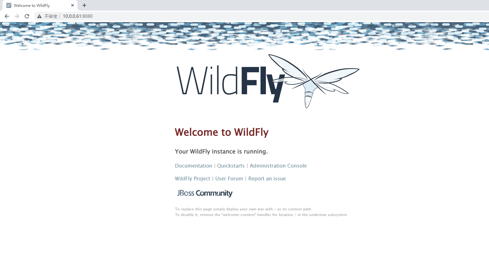
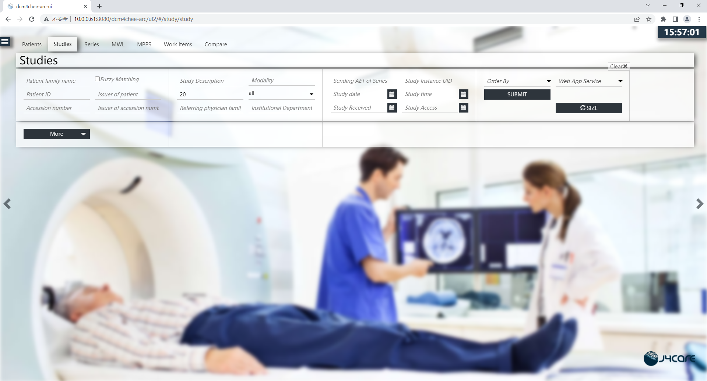

# Deploy dcm4chee-arc-light on docker

[dcm4che/dcm4chee-arc-light](https://github.com/dcm4che/dcm4chee-arc-light) | [Running on Docker](https://github.com/dcm4che/dcm4chee-arc-light/wiki/Running-on-Docker)

[dcm4che/dcm4chee-arc-light](https://github.com/dcm4che/dcm4chee-arc-light) is a DICOM Archive J2EE application. Let's deploy it on docker.

!!!note
    Run minimum set of archive services on a single host



## Use docker-compose

Create `docker-compose.yml`:
```yml
version: "3"
services:
  ldap:
    image: dcm4che/slapd-dcm4chee:2.6.0-26.0
    logging:
      driver: json-file
      options:
        max-size: "10m"
    ports:
      - "389:389"
    env_file: docker-compose.env
    volumes:
      - /var/local/dcm4chee-arc/ldap:/var/lib/openldap/openldap-data
      - /var/local/dcm4chee-arc/slapd.d:/etc/openldap/slapd.d
  db:
    image: dcm4che/postgres-dcm4chee:14.2-26
    logging:
      driver: json-file
      options:
        max-size: "10m"
    ports:
      - "5432:5432"
    env_file: docker-compose.env
    volumes:
      - /etc/localtime:/etc/localtime:ro
      - /etc/timezone:/etc/timezone:ro
      - /var/local/dcm4chee-arc/db:/var/lib/postgresql/data
  arc:
    image: dcm4che/dcm4chee-arc-psql:5.26.0
    logging:
      driver: json-file
      options:
        max-size: "10m"
    ports:
      - "8080:8080"
      - "8443:8443"
      - "9990:9990"
      - "9993:9993"
      - "11112:11112"
      - "2762:2762"
      - "2575:2575"
      - "12575:12575"
    env_file: docker-compose.env
    environment:
      WILDFLY_CHOWN: /opt/wildfly/standalone /storage
      WILDFLY_WAIT_FOR: ldap:389 db:5432
    depends_on:
      - ldap
      - db
    volumes:
      - /etc/localtime:/etc/localtime:ro
      - /etc/timezone:/etc/timezone:ro
      - /var/local/dcm4chee-arc/wildfly:/opt/wildfly/standalone
      - /var/local/dcm4chee-arc/storage:/storage
```

Create `docker-compose.env`:
```ini
STORAGE_DIR=/storage/fs1
POSTGRES_DB=pacsdb
POSTGRES_USER=pacs
POSTGRES_PASSWORD=pacs
```

Run the following command:
```bash
$ sudo docker-compose -p dcm4chee up -d
```



When everything okay, you can visit `http://<docker-host>:8080/dcm4chee-arc/ui2`, for me it is `http://10.0.0.61:8080/dcm4chee-arc/ui2`.



## Web Service URLs
- Archive UI: `http://<docker-host>:8080/dcm4chee-arc/ui2` - if secured, login with

  Name | Password | Role(s)
  --- | --- | --- 
  `root` | `changeit` | `user`<br/> `root`<br/> `auditlog`<br/> `ADMINISTRATOR`<br/> all roles specified by client `realm-management`
  `admin` | `changeit` | `user`<br/> `admin`
  `user` | `changeit`| `user`

- Wildfly Administration Console: `http://<docker-host>:9990`, login with Username: `root`, Password: `changeit`.
- DICOM QIDO-RS Base URL: `http://<docker-host>:8080/dcm4chee-arc/aets/DCM4CHEE/rs`
- DICOM STOW-RS Base URL: `http://<docker-host>:8080/dcm4chee-arc/aets/DCM4CHEE/rs`
- DICOM WADO-RS Base URL: `http://<docker-host>:8080/dcm4chee-arc/aets/DCM4CHEE/rs`
- DICOM WADO-URI: `http://<docker-host>:8080/dcm4chee-arc/aets/DCM4CHEE/wado`
- IHE XDS-I Retrieve Imaging Document Set: `http://<docker-host>:8080/dcm4chee-arc/xdsi/ImagingDocumentSource`

## Daily Operation

Deploy:
```bash
$ sudo docker-compose -p dcm4chee up -d
```

Stop:
```bash
$ sudo docker-compose -p dcm4chee stop
```

Start:
```bash
$ sudo docker-compose -p dcm4chee start
```

Stop and delete:
```bash
$ sudo docker-compose -p dcm4chee down
```

## Probably Exceptions

```bash
Error response from daemon: driver failed programming external connectivity on endpoint dcm4chee-arc-1 (62ca0417c9a8b09df3a5108e83df6a10b19cf858f68770edaa5eadbbec113ea5): Error starting userland proxy: listen tcp4 0.0.0.0:9993: bind: address already in use
```

This because tcp4 `9993` port is already in use, I used `netstat -alnt | grep 9993` to find the reason, and finally found that I used [Zerotier](https://www.zerotier.com/) and it uses tcp4 `9993`.

Just delete the `- "9993:9993"` in `docker-compose.yml`. (The only thing affects is you cannot visit the `Administration Console` from another docker stack without reverse proxy)
