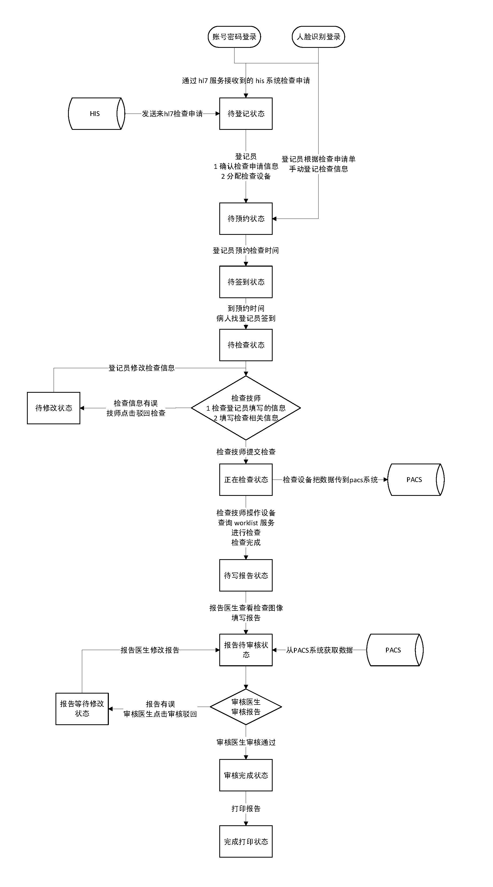

# Introduction

## [Picture archiving and communication system (PACS)](https://en.wikipedia.org/wiki/Picture_archiving_and_communication_system)

A picture archiving and communication system (PACS) is a medical imaging technology which provides economical storage and convenient access to images from multiple modalities (source machine types). Electronic images and reports are transmitted digitally via PACS; this eliminates the need to manually file, retrieve, or transport film jackets, the folders used to store and protect X-ray film. The universal format for PACS image storage and transfer is DICOM (Digital Imaging and Communications in Medicine). Non-image data, such as scanned documents, may be incorporated using consumer industry standard formats like PDF (Portable Document Format), once encapsulated in DICOM. A PACS consists of four major components: The imaging modalities such as X-ray plain film (PF), computed tomography (CT) and magnetic resonance imaging (MRI), a secured network for the transmission of patient information, workstations for interpreting and reviewing images, and archives for the storage and retrieval of images and reports. Combined with available and emerging web technology, PACS has the ability to deliver timely and efficient access to images, interpretations, and related data. PACS reduces the physical and time barriers associated with traditional film-based image retrieval, distribution, and display.

## [Radiological information system (RIS)](https://en.wikipedia.org/wiki/Radiological_information_system)

A radiological information system (RIS) is the core system for the electronic management of imaging departments. The major functions of the RIS can include patient scheduling, resource management, examination performance tracking, reporting, results distribution, and procedure billing. RIS complements HIS (hospital information systems) and PACS (picture archiving and communication system), and is critical to efficient workflow to radiology practices.

## [Hospital information system (HIS)](https://en.wikipedia.org/wiki/Hospital_information_system)

A hospital information system (HIS) is an element of health informatics that focuses mainly on the administrational needs of hospitals. In many implementations, a HIS is a comprehensive, integrated information system designed to manage all the aspects of a hospital's operation, such as medical, administrative, financial, and legal issues and the corresponding processing of services. Hospital information system is also known as hospital management software (HMS) or hospital management system.

## [Weasis](https://github.com/nroduit/Weasis)

Weasis is a free medical DICOM viewer used in healthcare by hospitals, health networks, multicenter research trials, and patients.

Official GitHub repo: https://github.com/nroduit/Weasis

Build Plugins: https://nroduit.github.io/en/basics/customize/build-plugins/

## [dcm4che](https://github.com/dcm4che/dcm4che)

Official GitHub repo: https://github.com/dcm4che/dcm4che

Official Application: https://github.com/dcm4che/dcm4chee-arc-light
