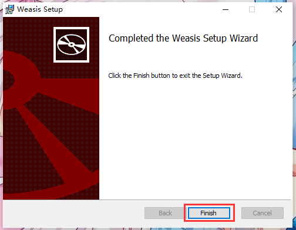

# Installation

## Preparation

First, you need to download the installer. [Here](https://nroduit.github.io/en/getting-started/download) is the entrance for downloading. For example, my platform is `Windows 10 x64`, so the following package is what I need:

!!!note
    If the website is updated when you download, maybe the content you see is inconsistent with the above screenshot, which is normal. Please select the appropriate version to download.

## Setup

After downloading, you will see an executable file. Double click it and then the following form you will be shown, just check the license and click the `Install` button:

Then after a short waiting, the installation will be done, as the following form, you just need to click the `Finish` button:

## How to use

Now it has been installed successfully. If you have a file with `DCM` extension like the following screenshot, double click it to open with weasis.

Here is a possible situation after double clicking:

!!!note
    If you cannot open it successfully, try to use Windows Search to find the Weasis main program, and set the default application for the DCM extension file.
